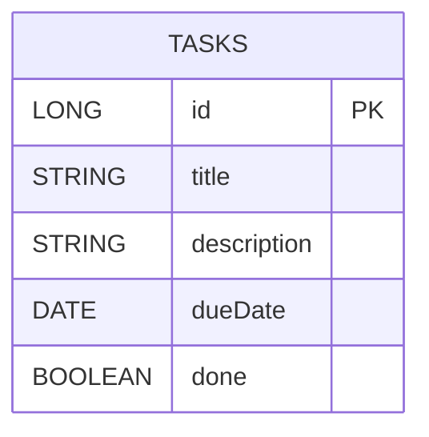

ARCHITECTURE AND FLOW

This document explains the project's code structure, responsibilities of each component, typical runtime flows (Create, Read/List, Update, Toggle Done, Delete), and includes diagrams drawn using Mermaid. It is intended for developers joining the project who want a high-level and code-level understanding.

1. Project overview

- Framework: Spring Boot (MVC + Thymeleaf templates)
- Persistence: Spring Data JPA (Hibernate) with H2 for development; MySQL plan for production
- Migration tool: Flyway (db/migration/V1__init.sql)
- UI: Thymeleaf templates in `src/main/resources/templates` (Bootstrap 5)

2. Key packages and files

- `src/main/java/com/tasktracker/tasktracker/TasktrackerApplication.java`
  - Spring Boot application entry point.

- `src/main/java/com/tasktracker/tasktracker/model/Task.java`
  - JPA entity for tasks. Fields: `id`, `title`, `description`, `dueDate`, `done`.
  - Mapped to `tasks` table (Flyway migration creates it).

- `src/main/java/com/tasktracker/tasktracker/repo/TaskRepository.java`
  - Extends `JpaRepository<Task, Long>`.
  - Convenience finder: `findByTitleContainingIgnoreCase(String title)`.

- `src/main/java/com/tasktracker/tasktracker/service/TaskService.java`
  - Encapsulates repository access and business logic.
  - Methods: `findAll()`, `searchByTitle(String)`, `save(Task)`, `findById(Long)`, `deleteById(Long)`.

- `src/main/java/com/tasktracker/tasktracker/controller/TaskController.java`
  - MVC controller exposing routes:
    - `GET /` and `GET /tasks` - list tasks with optional search
    - `GET /tasks/new` - show create form
    - `POST /tasks` - save (create/update)
    - `GET /tasks/{id}` - details
    - `GET /tasks/{id}/edit` - edit form
    - `POST /tasks/{id}/toggle` - toggle done
    - `POST /tasks/{id}/delete` - delete

- Templates
  - `src/main/resources/templates/task_list.html` - listing view with actions
  - `src/main/resources/templates/task_form.html` - create/edit form (Thymeleaf-bound)
  - `src/main/resources/templates/task_details.html` - single task view

- `src/main/resources/db/migration/V1__init.sql`
  - Flyway baseline migration (creates `tasks` table with columns matching `Task` entity)

- `src/main/resources/application.properties`
  - H2 file-backed datasource and JPA settings

3. Runtime flows (diagrams in Mermaid)

Create / Update flow

```mermaid
flowchart TD
  A[User opens "New Task" form] --> B[Browser displays `task_form.html`]
  B --> C[User fills fields and clicks Save]
  C --> D[POST /tasks with form data]
  D --> E[TaskController receives request and calls TaskService.save(task)]
  E --> F[TaskService maps/validates and calls TaskRepository.save(task)]
  F --> G[Hibernate issues INSERT or UPDATE SQL to DB]
  G --> H[Flyway-managed schema persists data in H2]
  H --> I[Controller redirects to /tasks (list) or /tasks/{id}]
  I --> J[User sees updated list / details]
```

Read / List flow

```mermaid
flowchart TD
  A[User visits /tasks or /] --> B[TaskController.findAll()/searchByTitle()] --> C[TaskService calls TaskRepository.findAll()/findByTitleContainingIgnoreCase()] --> D[Repository returns List<Task>] --> E[Controller populates model and returns `task_list.html`] --> F[Browser renders list with actions]
```

Toggle Done flow

```mermaid
flowchart TD
  A[User clicks toggle done button] --> B[POST /tasks/{id}/toggle]
  B --> C[Controller loads Task via TaskService.findById(id)]
  C --> D[Controller flips `task.done` value and calls TaskService.save(task)]
  D --> E[Repository.save() -> UPDATE SQL]
  E --> F[Controller redirects back to list]
```

Delete flow

```mermaid
flowchart TD
  A[User clicks delete] --> B[Browser confirms via JS modal] --> C[POST /tasks/{id}/delete]
  C --> D[Controller calls TaskService.deleteById(id)] --> E[Repository.deleteById(id) -> DELETE SQL] --> F[Controller redirects to /tasks]
```

Startup flow (application lifecycle)

```mermaid
flowchart TD
  A[Spring Boot starts] --> B[Auto-config creates DataSource (H2) and JPA EntityManager] --> C[Flyway runs migrations from db/migration] --> D[Hibernate validates/creates mappings] --> E[Application ready and controllers/routes active]
```

4. Data model (ER diagram)



5. Detailed file-by-file explanation

- `Task.java` (entity)
  - Annotations: `@Entity`, `@Table(name = "tasks")`, `@Id`, `@GeneratedValue` etc.
  - `title` has validation constraints (e.g., `@NotBlank`) on the form-side and/or controller.
  - `dueDate` is `LocalDate` and is mapped to SQL DATE.

- `TaskRepository.java`
  - Very small: extends `JpaRepository<Task, Long>` giving CRUD methods.
  - `findByTitleContainingIgnoreCase(String title)` is used by controller search.

- `TaskService.java`
  - Why service? Keeps controller thin, centralizes business rules (like normalizing titles, validation beyond basic Bean Validation, or complex cascade logic in future).
  - Example methods:
    - `List<Task> findAll()` delegates to repository
    - `List<Task> searchByTitle(String q)` delegates to `findByTitleContainingIgnoreCase`
    - `Task save(Task t)` performs any normalization then `repository.save(t)`

- `TaskController.java`
  - Uses `@Controller` and `@RequestMapping` for `/tasks`
  - Methods return view names and use `Model` to pass `tasks` or `task` for form binding.
  - Important: CSRF protection (Spring Security default) requires `th:action` or hidden CSRF token in forms when Spring Security is active. In this project, forms include Thymeleaf CSRF tokens placeholders.

- Templates
  - `task_form.html` binds to `th:object="${task}"` and uses `th:field` for inputs so that create and edit reuse the same template.
  - `task_list.html` iterates `th:each="task : ${tasks}"` to show rows and contains small forms for toggle/delete actions.

6. Edge cases and error handling

- Missing required fields
  - Controller should validate inputs using `@Valid` and `BindingResult`; on errors, return the same `task_form.html` with field errors highlighted.

- Concurrent edits
  - Two users edit the same task simultaneously. Solution: implement optimistic locking (`@Version`) on `Task` if concurrency is a concern.

- Large lists
  - If tasks grow large, switch to pageable repository methods and UI pagination.

- Date parsing/format
  - Ensure `LocalDate` binding uses `ISO` format or configure `@DateTimeFormat` on the `dueDate` field and frontend pattern matching.

- Missing task id
  - When `TaskService.findById(id)` returns empty, controller should return 404 or redirect with an error flash attribute.

7. Testing guidance and examples

- Unit tests
  - `TaskService` can be tested with `@DataJpaTest` or mocking `TaskRepository` with Mockito.
  - Example: test save() persists and findAll() returns expected.

- Integration tests
  - Use `@SpringBootTest` + `@AutoConfigureMockMvc` to test controllers and template rendering.
  - Use the H2 db for integration tests by default unless running a test profile for MySQL.

- Manual smoke test commands (PowerShell)

```powershell
.\mvnw.cmd -DskipTests=false test
.\mvnw.cmd spring-boot:run
# Then open http://localhost:8080/tasks
```

8. Migration to MySQL

- Switch configuration in `src/main/resources/application-mysql.properties` and run with `--spring.profiles.active=mysql` or set env `SPRING_PROFILES_ACTIVE=mysql`.
- Before switching, ensure Flyway migrations are compatible with MySQL (they usually are for simple DDL used here).
- Use environment variables for credentials (e.g., `spring.datasource.password=${MYSQL_PASSWORD}`) and DO NOT commit plaintext passwords.

9. Next steps and TODOs

- Add `@Version` to `Task` if optimistic locking desired.
- Add paginated listing when dataset grows.
- Add CSV/JSON import/export for data migration or integrate a proper backup tool for production.

10. Contact

For questions, open an issue or ping the maintainer in your team's chat.

11. Method & Annotation Reference

This section lists the main public methods across the small codebase and explains the Spring / JPA / Thymeleaf annotations you will encounter. Use this as a quick reference while navigating the code.

General annotation glossary

- `@SpringBootApplication` (on `TasktrackerApplication`): convenience annotation that aggregates `@Configuration`, `@EnableAutoConfiguration`, and `@ComponentScan`. It bootstraps the Spring context and starts embedded Tomcat by default.
- `@Entity` (on `Task`): marks the class as a JPA entity. Each instance maps to a table row.
- `@Table(name = "tasks")` (on `Task`): optional; sets the explicit table name used for the entity.
- `@Id` (on a field in `Task`): marks the primary key property.
- `@GeneratedValue` (on id): instructs JPA to auto-generate the primary key using the configured strategy.
- `@Column` (on fields, optional): customizes column mapping (name, length, nullability).
- `@NotBlank`, `@NotNull` (Bean Validation): validate incoming values (typically used for `title` or other required fields). Controller must use `@Valid` and `BindingResult` to trigger and read validation errors.
- `@DateTimeFormat` (on `LocalDate` fields in forms or DTOs): tells Spring how to parse/format the date values when binding from form input.
- `@Repository` (on `TaskRepository`, optional): marks the interface as a repository and enables translation of persistence exceptions into Spring's DataAccessException.
- `@Service` (on `TaskService`, optional): marks the class as a service component; a semantic indicator for the Spring component scan.
- `@Controller` (on `TaskController`): registers a web controller that returns view names and uses `Model` to pass attributes to templates.
- `@RequestMapping`, `@GetMapping`, `@PostMapping`: map HTTP paths and methods to controller handler methods. `@GetMapping("/tasks")` is equivalent to `@RequestMapping(value = "/tasks", method = RequestMethod.GET)`.
- `@PathVariable` (on controller method parameters): binds a URI template variable (e.g., `{id}`) to a method parameter.
- `@ModelAttribute` (on controller method parameters): binds a model attribute (often used for form objects). `th:object` in Thymeleaf binds to the model attribute by name.
- `@Valid` (on form backing objects): triggers Bean Validation on the input object. Use with `BindingResult` to inspect errors.
- `@Autowired` (constructor injection is preferred): injects required dependencies (repositories/services). Using constructor injection (no-arg not needed) is the modern recommended approach.

Controller methods reference (high-level behavior)

- `GET /` and `GET /tasks` -> listTasks(Model model, @RequestParam(required = false) String q)
  - Calls `taskService.findAll()` when `q` is empty or `taskService.searchByTitle(q)` when `q` is present.
  - Puts `tasks` into the `Model` and returns view `task_list`.

- `GET /tasks/new` -> showCreateForm(Model model)
  - Adds an empty `Task` instance to the model with key `task` (used by `task_form.html` via `th:object`) and returns the `task_form` view.

- `POST /tasks` -> saveTask(@ModelAttribute @Valid Task task, BindingResult result)
  - If `result.hasErrors()` returns true, returns `task_form` view to show validation errors.
  - Otherwise calls `taskService.save(task)` and redirects to the list or details page.

- `GET /tasks/{id}` -> showDetails(@PathVariable Long id, Model model)
  - Attempts `taskService.findById(id)`; if present, adds to model and returns `task_details` view. If missing, returns 404 or redirects with an error.

- `GET /tasks/{id}/edit` -> editForm(@PathVariable Long id, Model model)
  - Loads the `Task`, puts it in the model as `task` for `task_form.html` (same template as create).

- `POST /tasks/{id}/toggle` -> toggleDone(@PathVariable Long id)
  - Loads `Task` by id, flips boolean `done`, calls `taskService.save(task)`, and redirects back to list.

- `POST /tasks/{id}/delete` -> delete(@PathVariable Long id)
  - Calls `taskService.deleteById(id)` then redirects to the list view.

Service methods reference

- `List<Task> findAll()`
  - Delegates to `taskRepository.findAll()`; consider returning an immutable list or a stream if you need to operate lazily.

- `List<Task> searchByTitle(String q)`
  - Delegates to `taskRepository.findByTitleContainingIgnoreCase(q)`.

- `Task save(Task t)`
  - Normalizes fields if necessary and calls `taskRepository.save(t)`.
  - Returns the persisted instance (with generated id on create).

- `Optional<Task> findById(Long id)`
  - Calls `taskRepository.findById(id)` and returns an `Optional` so callers explicitly handle the absent case.

- `void deleteById(Long id)`
  - Calls `taskRepository.deleteById(id)`; consider catching `EmptyResultDataAccessException` if delete may be called on missing ids.

Repository methods reference

- `List<Task> findAll()` (inherited from `JpaRepository`)
- `Optional<Task> findById(Long id)` (inherited)
- `Task save(Task entity)` (inherited)
- `void deleteById(Long id)` (inherited)
- `List<Task> findByTitleContainingIgnoreCase(String title)` (custom derived query)

Templates (Thymeleaf) reference

- `th:object="${task}"` on `task_form.html` binds the form to a `Task` object in the model.
- `th:field="*{title}"` binds the input to the `title` property of the bound object.
- `th:each="task : ${tasks}"` iterates over the `tasks` collection supplied by the controller.
- `th:action="@{/tasks}"` resolves to the action URL and ensures Thymeleaf integrates with Spring's CSRF tokens when Spring Security is active.

Notes on validation & Binding

- Use `@Valid` on controller parameters to validate bean constraints and `BindingResult` to check errors. Example:

  public String saveTask(@ModelAttribute @Valid Task task, BindingResult bindingResult) {
      if (bindingResult.hasErrors()) {
          return "task_form";
      }
      taskService.save(task);
      return "redirect:/tasks";
  }

- When decorating the `Task` entity with validation annotations, prefer putting DTO/form classes if you later diverge entity and form requirements. For this small app, adding bean validation directly on `Task` is acceptable.

Security & CSRF

- If you add `spring-boot-starter-security`, forms that POST/PUT/DELETE require CSRF tokens unless disabled. Thymeleaf provides a simple way to insert the token into forms using the Spring Security dialect or `th:action` + `input type="hidden"` with the token.

Completing the doc

This section is intended to be kept in sync with the code. When you add new controller endpoints, services, repository queries, or entity fields, please update this reference so new contributors can discover behavior quickly.

12. Learning path for beginners (step-by-step)

This section is written for a fresher/newcomer to Spring who wants to learn by reading and experimenting with this repository. It walks through the key concepts, shows annotated code snippets, and suggests hands-on exercises.

Prerequisites

- Basic Java syntax and OOP concepts
- A Java JDK installed (we recommend JDK 17 or JDK 21) and `JAVA_HOME` configured
- Maven (the project includes a Maven wrapper so you can use `./mvnw` or `.
mvnw.cmd` on Windows)
- A code editor (VS Code, IntelliJ IDEA) with Java support

Quick start: run the app locally

1. Open PowerShell in the repository root.

```powershell
.\mvnw.cmd -DskipTests=false test
.\mvnw.cmd spring-boot:run
# open http://localhost:8080/tasks in your browser
```

2. If tests fail to compile with an error about "No compiler is provided...", install a JDK and set `JAVA_HOME`.

High-level learning steps

1) Understand the entity: `Task`

  - Open `src/main/java/com/tasktracker/tasktracker/model/Task.java`.
  - You will see a POJO (plain old Java object) annotated with JPA annotations.
  - Annotation purpose (simple): `@Entity` makes it persistable; `@Id` identifies the primary key; `@GeneratedValue` auto-generates the id.

Annotated example (simplified):

```java
@Entity
@Table(name = "tasks")
public class Task {
    @Id
    @GeneratedValue
    private Long id;

    @NotBlank
    private String title;

    private String description;

    @DateTimeFormat(iso = DateTimeFormat.ISO.DATE)
    private LocalDate dueDate;

    private boolean done;

    // getters & setters
}
```

2) Explore the repository: `TaskRepository`

  - Located at `src/main/java/com/tasktracker/tasktracker/repo/TaskRepository.java`.
  - It extends `JpaRepository<Task, Long>` which gives you methods like `findAll()`, `findById()`, `save()`, and `deleteById()` for free.

3) Read service layer: `TaskService`

  - Located at `src/main/java/com/tasktracker/tasktracker/service/TaskService.java`.
  - The service acts as a thin wrapper around the repository and is the right place to put business logic such as normalization, validation beyond simple bean constraints, or transactional operations.

4) Inspect the controller: `TaskController`

  - Located at `src/main/java/com/tasktracker/tasktracker/controller/TaskController.java`.
  - Controller maps HTTP routes to Java methods. For example:

```java
@GetMapping("/tasks")
public String listTasks(Model model, @RequestParam(required = false) String q) {
    List<Task> tasks = (q == null || q.isBlank()) ? taskService.findAll() : taskService.searchByTitle(q);
    model.addAttribute("tasks", tasks);
    return "task_list"; // Thymeleaf template name
}
```

5) Look at templates (Thymeleaf)

  - `src/main/resources/templates/task_list.html` shows how to iterate `tasks` and render fields.
  - `task_form.html` uses `th:object` and `th:field` to bind the form to a `Task` instance.

Hands-on exercises (recommended for a fresher)

1. Add a new field `priority` to `Task` (enum LOW/MEDIUM/HIGH)
  - Update `Task.java` with the new field and getter/setter.
  - Add an input/select in `task_form.html` to set priority.
  - Update `task_list.html` to display `priority` column.
  - Restart the app and verify create/edit works.

2. Add validation to `title` (already present as `@NotBlank`)
  - Try submitting an empty title from the form and see the error.
  - Implement `@Valid` and `BindingResult` handling if not present.

3. Add pagination
  - Change `TaskRepository` usage to use `Pageable` and update controller to accept `page` and `size` params.

4. Create an integration test
  - Add a `@SpringBootTest` and `@AutoConfigureMockMvc` test that POSTs a new Task and then GETs the list to verify it appears.

Annotated debugging tips

- If templates don't render expected values, check that the model attribute names in controller match those referenced in templates (`model.addAttribute("task", task)` and `th:object="${task}"`).
- If JPA returns empty lists unexpectedly, check that Flyway ran successfully and that the application is pointing to the H2 file DB configured in `application.properties`.
- For binding issues on `LocalDate`, check `@DateTimeFormat` and the date input format in HTML (`<input type="date">` usually works with ISO Date).

Useful commands for learning and debugging

```powershell
# Run tests (unit + integration)
.\mvnw.cmd -DskipTests=false test

# Run the app (auto-restart not configured here; use your IDE for hot reload)
.\mvnw.cmd spring-boot:run

# Run only specific test class
.\mvnw.cmd -Dtest=TaskServiceTests test
```

How to learn faster with this repo

- Make small changes (one small field, then test) and run the app frequently.
- Read controller -> service -> repository path for a request and put breakpoints (IDE) or log statements to see runtime state.
- Keep the `ARCHITECTURE_AND_FLOW.md` open while exploring code so you can map the documentation to actual files.

Wrapping up

This project is intentionally small to give you a clear end-to-end path from UI to DB. Follow the exercises and use the code reference sections to deepen your understanding. When you feel comfortable, try adding a small feature (export to CSV, filtering by status, or user-assigned tasks) and update the docs with your changes.

13. Exact method signatures (matched to code)

Below are the exact public method signatures found in the current codebase. Copy/paste or reference these when writing tests or reading the code.

Task entity (getters/setters)

- `public Long getId()`
- `public void setId(Long id)`
- `public String getTitle()`
- `public void setTitle(String title)`
- `public String getDescription()`
- `public void setDescription(String description)`
- `public LocalDate getDueDate()`
- `public void setDueDate(LocalDate dueDate)`
- `public boolean isDone()`
- `public void setDone(boolean done)`

Repository interface

- `public interface TaskRepository extends JpaRepository<Task, Long>`
  - `List<Task> findByTitleContainingIgnoreCase(String q)`

Service public methods (`TaskService`)

- `public List<Task> findAll()`
- `public List<Task> searchByTitle(String q)`
- `public Task save(Task task)`
- `public Task findById(Long id)`
- `public void deleteById(Long id)`

Controller public handler methods (`TaskController`)

- `@GetMapping("/tasks/new") public String showCreateForm(Model model)`
- `@PostMapping("/tasks") public String saveTask(@Valid @ModelAttribute Task task, BindingResult bindingResult, Model model)`
- `@GetMapping({ "/tasks", "/" }) public String listTasks(@RequestParam(required = false) String q, Model model)`
- `@GetMapping("/tasks/{id}") public String taskDetails(@org.springframework.web.bind.annotation.PathVariable Long id, Model model)`
- `@GetMapping("/tasks/{id}/edit") public String editTask(@org.springframework.web.bind.annotation.PathVariable Long id, Model model)`
- `@PostMapping("/tasks/{id}/toggle") public String toggleDone(@org.springframework.web.bind.annotation.PathVariable Long id)`
- `@PostMapping("/tasks/{id}/delete") public String deleteTask(@org.springframework.web.bind.annotation.PathVariable Long id)`

Notes

- `TaskService.findById(Long id)` returns `null` when the task is not found in the current implementation (it wraps `Optional.orElse(null)`). Consider changing it to return `Optional<Task>` for clearer absent-value handling.
- Controller path variable annotations use the full package (`@org.springframework.web.bind.annotation.PathVariable`) in the source — functionally identical to an imported `@PathVariable`.

Keep this section synced with the code: when signatures change, update this list so learners can copy exact method calls and write accurate tests.

14. Recent changes (validation + security) — developer notes

I applied three changes you asked for to prepare the repo for next steps (JWT/OAuth) and to add a short validation lab:

- Added `@FutureOrPresent` on `Task.dueDate` to ensure due dates are not in the past. Validation message: "Due date must be today or in the future".
- Added a new test `DueDateValidationTests` in `src/test/java/...` which posts a past date and expects a binding error on `dueDate`. This is a failing test until templates and controller are properly wired to show validation errors — it serves as a guided lab.
- Added `spring-boot-starter-security` and a minimal `SecurityConfig` which enables simple form login and allows access to the H2 console (frames). This is a stepping stone toward JWT/OAuth; when you add JWT or OAuth flows we'll expand `SecurityConfig`.

Run these checks locally after you have a JDK installed and `JAVA_HOME` set:

```powershell
.\mvnw.cmd -U clean test
.\mvnw.cmd spring-boot:run
```

If you want me to implement the controller/template changes to render validation messages (so the tests pass), I can do that in the next commit. If you prefer to keep these as lab exercises for learners, leave them as-is.

Next steps toward JWT/OAuth

1. Add JWT support: configure stateless `SecurityFilterChain`, add `/api/**` endpoints as a Resource Server.
2. Add OAuth2 Login: configure client registration for Google/GitHub and protect the UI routes.
3. Add roles/claims mapping and UI for account linking.

15. Changelog & run instructions (how to get the repo building locally)

Edits applied in this branch/workspace

- `pom.xml`
  - Added `org.springframework.boot:spring-boot-starter-thymeleaf` (Thymeleaf templates).
  - Switched parent POM to a stable Spring Boot release (non-SNAPSHOT) and removed snapshot repositories.
  - Added `spring-boot-starter-security` to prepare for JWT/OAuth work.

- `src/main/resources/templates/task_list.html`
  - Fixed a Thymeleaf expression for date formatting: `th:text` now uses a single `${...}` with the ternary inside.

- `src/main/resources/templates/task_form.html`
  - Fixed page title and moved `xmlns:th` to the `<html>` tag.

- `src/main/resources/application.properties`
  - Changed `spring.jpa.hibernate.ddl-auto=update` → `validate` to let Flyway own schema changes.

- `src/main/java/com/tasktracker/tasktracker/model/Task.java`
  - Added `@FutureOrPresent` to `dueDate` to prevent past dates.

- `src/main/java/com/tasktracker/tasktracker/config/SecurityConfig.java`
  - Added a minimal security configuration that enables form login and permits `/h2-console/**` (useful for dev).

- Tests
  - Added `TaskValidationLabTests` (guided lab) and `DueDateValidationTests` which exercise validation flows.

Windows: install JDK and set `JAVA_HOME`

1. Download and install an LTS JDK (OpenJDK 17 or 21) from Adoptium or Azul.

2. Set `JAVA_HOME` and update `PATH` (PowerShell - run as admin if you need to modify system env):

```powershell
# Replace the path below with the actual installation path
[Environment]::SetEnvironmentVariable('JAVA_HOME', 'C:\Program Files\Eclipse Adoptium\jdk-17.0.8.7-hotspot', 'User')
[Environment]::SetEnvironmentVariable('Path', $env:Path + ';' + $env:JAVA_HOME + '\bin', 'User')
# Restart the shell to pick up the new environment vars
```

3. Verify:

```powershell
javac -version
java -version
```

Resolve parent POM issues and run Maven

If Maven reports a non-resolvable parent POM (cached failure), force updates and run the build:

```powershell
.\mvnw.cmd -U clean test
.\mvnw.cmd spring-boot:run
```

Notes if parent POM still fails

- Ensure you have network access to `https://repo.maven.apache.org/maven2`.
- If you encounter a cached resolution error, delete the cached metadata for the failing artifact in your local Maven repo (`%USERPROFILE%\.m2\repository\org\springframework\boot\spring-boot-starter-parent`) and run `.\mvnw.cmd -U` again.

Quick troubleshooting checklist

- Compilation error "No compiler is provided" → install JDK and set `JAVA_HOME` (see above).
- Thymeleaf expressions fail to render → ensure `spring-boot-starter-thymeleaf` is on the classpath and `xmlns:th` is declared on the `<html>` element.
- H2 console frame blocked → ensure `SecurityConfig` sets `http.headers().frameOptions().sameOrigin()` (already added).
- Flyway conflicts with Hibernate DDL → use `spring.jpa.hibernate.ddl-auto=validate` or remove Flyway.

If you want, I can now:

A) Run `.\mvnw.cmd -U clean test` here and iterate on any remaining build/test failures (requires JDK available in this environment), or
B) Implement controller/template changes so the validation tests pass and update the lab to be a passing example, or
C) Start the JWT/OAuth scaffolding (add resource-server, configure client registration for OAuth2 login).


